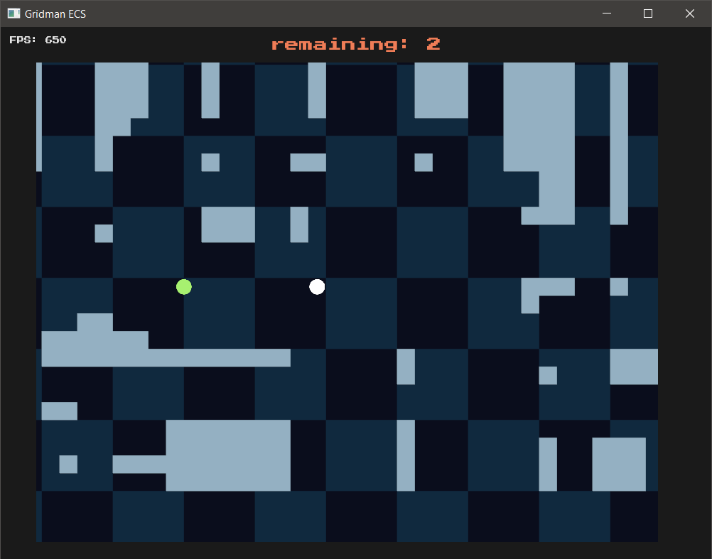

## A simple grid-based game in Bevy 0.16.1.

This project was created as a learning exercise to understand Rust and Bevy's ECS paradigm. I have only been learning Rust and Bevy for two weeks, and this is my second application.

You will certainly find areas where the code could be improved. Please feel free to offer suggestions!

  
  
Screenshot of the Gridman ECS game in action.

## Demonstrates:

- Tile-Based Scrolling: The camera remains fixed whilst the maps scrolls beneath it, with border artefacts hidden by sprite blocks.

- Procedural Map Generation: Generates random maps using a random walk algorithm to carve out paths in a grid-based world.

- Grid-Based Movement: Entities (player, enemies, projectiles) move 1 tile at a time, with players and enemies reserving that space in advance.

- Collision Detection: Combines (AABB) collision detection and adjacency-based collision for performant player-enemy-projectile interactions.

- Responsive Resizing: All game elements automatically resize in response to window size changes.

- State Management: Manages different game states (Loading, Title, Playing, Victory) to control game flow.

## Controls:

W, A, S, D: Move the player up, left, down, or right on the grid.

Space or Left Mouse Click: Shoot a projectile in the player's current direction.

Escape: Quit game.

## Gameplay:

Navigate the procedurally generated map, avoid enemies, and shoot projectiles to destroy them.

Beware your bullet rebounds!

Clear all enemies to achieve level victory, which doubles the enemy count for the next round.

1 mistake and the game is over.

I'm actually surprised how something this simple can still be kind of fun.

## Assets

The font "Press Start 2P" (cody@zone38.net) is licensed under the SIL OPEN FONT LICENSE Version 1.1

The color palette is [Sweetie-16](https://lospec.com/palette-list/sweetie-16) by GrafxKid.

## License

This project, with the exception of the font, is licensed under the MIT License. See the LICENSE file for details.

## Installation

- A binary release is available to PC users who don't want to compile the game themselves.

- Ensure [Rust](https://www.rust-lang.org/learn/get-started) and [Bevy 0.16](https://bevy.org/learn/quick-start/getting-started) dependencies are installed.
- Clone this repository.
- Run the game with cargo run.
